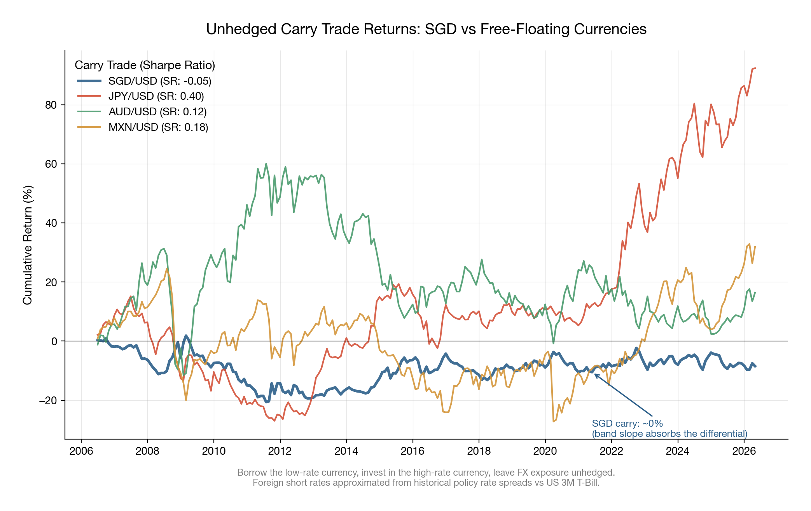
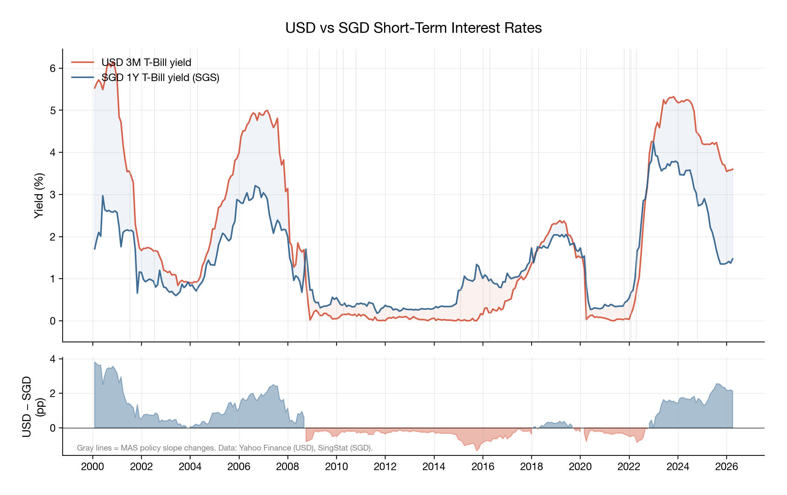
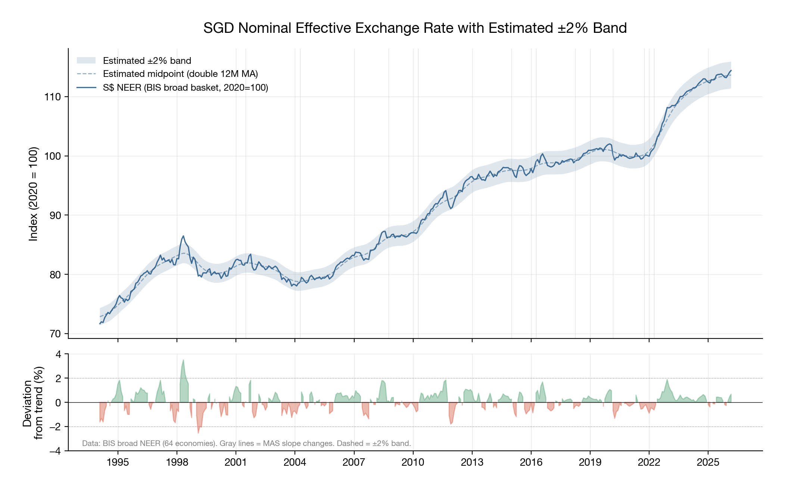
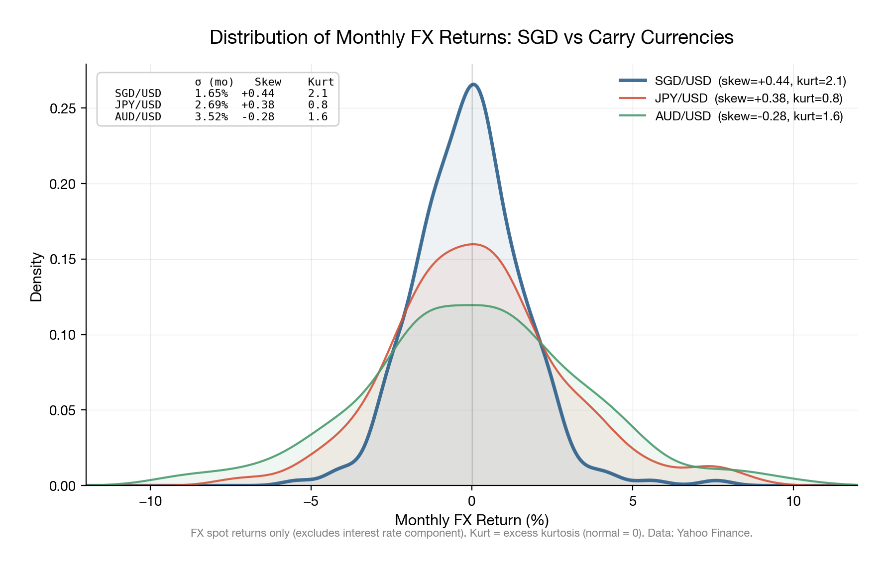
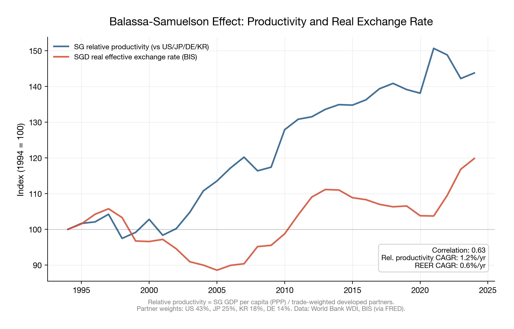

# The Carry Trade That Can't Exist

A friend just took out his first mortgage in Singapore. We debated why his home loan rate was so much lower than what his colleagues in London were paying. I gave him my instinctive short answer (MAS manages the exchange rate, not interest rates, so domestic rates are a residual) and then spent the next few days thinking about the longer one.

Singapore's short rates sit 100 to 250 basis points below USD rates in most regimes. Over two decades of simulated unhedged carry (borrow SGD, invest in USD, leave FX open), the trade produces a Sharpe ratio of -0.05. The same trade in JPY delivers 0.40, AUD 0.12, MXN 0.18.

UIP failure is one of the most robust anomalies in international finance (Fama 1984, Engel 1996, and basically everyone since). Carry works for JPY, AUD, CHF, MXN. It does not work for SGD.

*Figure 2: Cumulative unhedged carry trade returns, 2005 to 2026. SGD/USD (Sharpe: -0.05) flatlines while JPY/USD (0.40), MXN/USD (0.18), and AUD/USD (0.12) show positive drift with crash risk. Data: Yahoo Finance. Foreign short rates for JPY, AUD, and MXN are approximated from historical policy rate spreads vs the US 3M T-bill; this affects the level of cumulative returns but not their qualitative shape.*

| Carry Trade | Ann. Return | Ann. Volatility | Sharpe Ratio | Skewness | Excess Kurtosis |
|---|---|---|---|---|---|
| SGD/USD | -0.28% | 5.72% | -0.05 | +0.42 | 2.08 |
| JPY/USD | +3.72% | 9.34% | 0.40 | +0.38 | 0.68 |
| AUD/USD | +1.51% | 12.22% | 0.12 | -0.26 | 1.58 |
| MXN/USD | +2.21% | 12.57% | 0.18 | -1.70 | 7.50 |

*Table 1: Summary statistics for unhedged carry trade returns, monthly data 2005 to 2026.*

## The MAS framework

MAS does not set an interest rate. It manages the SGD nominal effective exchange rate (NEER) against a trade-weighted basket. The policy instrument has three parameters: the slope of the band's midpoint (the rate of guided appreciation or depreciation), the width of the band (estimated at roughly ±2%), and the level (discrete re-centerings). Tightening means steepening the slope or re-centering upward. Easing means flattening or re-centering down. Parrado (2004) describes the mechanics; Khor, Robinson, and Saktiandi (2007) document the performance.

Singapore's domestic interest rates are endogenous. Markets set them through arbitrage against the expected exchange rate path. MAS never touches them directly, which is why my friend's mortgage rate is low.

Covered interest parity links the forward premium to the rate differential:

$$\frac{F - S}{S} \approx r_{SGD} - r_{USD}$$

If MAS guides 1.5% annual SGD appreciation, the forward market prices SGD stronger by that amount at the one-year horizon. Arbitrage forces SGD rates to settle roughly 150bp below USD rates. The rate differential and the expected currency move are the same quantity expressed in two different markets. A hedged carry trade (borrow SGD, invest USD, sell USD forward) nets exactly zero; the forward premium eats the rate pickup. Du, Tepper, and Verdelhan (2018) document CIP deviations across major currency pairs; SGD is among the tightest.

This is true everywhere. CIP kills hedged carry for every currency pair. The unhedged trade is where SGD gets unusual.

*Figure 1: USD 3M T-Bill yield vs SGD 1Y T-Bill yield (SGS), 2000 to 2026. The shaded area shows the interest rate differential. Gray vertical lines mark major MAS policy slope changes. Data: Yahoo Finance (USD), SingStat Table Builder (SGD).*

## Why unhedged carry also dies

The carry trade P&L is:

$$\pi = r_{USD} - r_{SGD} - \Delta s$$

where $\Delta s$ is the realised SGD appreciation over the holding period. UIP says $\mathbb{E}[\pi] = 0$: the expected appreciation exactly offsets the rate differential. Carry works when UIP fails, which for most currencies it does, badly and persistently (Lustig and Verdelhan 2007, Burnside et al. 2011). For SGD it holds, and the mechanism is the band itself.

**The band pins expectations.** MAS publishes the slope through policy statements and semi-annual reviews. The market knows, within narrow bounds, where SGD NEER will be in six or twelve months. For free-floating currencies, forming $\mathbb{E}[\Delta s]$ means processing central bank reaction functions, trade flows, risk appetite, speculative positioning, political risk. That uncertainty is what allows UIP to fail persistently; exchange rates of floating currencies approximate random walks (Engel and West 2005). The NEER band provides a public, credible, time-varying anchor. Expectations cluster around the guided path, and the wedge between the forward rate and expected future spot collapses.

Figure 3 shows this. The BIS broad NEER for SGD (covering 64 economies) traces a steady appreciation path from 72 in 1994 to 114 in 2026. An estimated ±2% band around a smoothed trend captures 98.4% of all monthly observations. Excursions beyond the band are rare and brief, concentrated around the 1997 Asian crisis and the 2022 global tightening cycle. The "surprise" component of SGD moves (the part not priced into the forward) is tiny.

*Figure 3: SGD nominal effective exchange rate (BIS broad basket, 64 economies, 2020=100), 1994 to 2026. The estimated ±2% band around a double-smoothed 12-month moving average captures 98.4% of monthly observations. Gray vertical lines mark major MAS slope changes. Data: BIS.*

**Pinned expectations make mean-reversion fast, and fast mean-reversion kills the carry window.** In free-floating currencies, carry works partly because real exchange rate mean-reversion is glacially slow; half-lives of PPP deviations run three to five years for major pairs (Rogoff 1996). Carry traders collect the differential while waiting for a reversion that may take half a decade. MAS is the mean-reversion mechanism for SGD. Deviations from the band midpoint trigger intervention. The standard deviation of monthly NEER deviations from the smoothed trend is 0.76 percentage points. In a typical month, SGD NEER sits within three-quarters of a percent of where the guided path says it should be. The horizon over which UIP might fail compresses to the point where there is nothing to collect.

**Fast mean-reversion is credible because MAS can defend the band indefinitely.** Singapore's foreign reserves exceed 100% of GDP. The current account runs a structural surplus. Public debt is accumulated for investment purposes (via GIC and Temasek), and the fiscal position is among the strongest globally. Reserve adequacy is the key determinant of exchange rate regime credibility (Obstfeld, Shambaugh, and Taylor 2005); Singapore sits at the extreme end of their scale. A short-SGD carry trader hoping for a "break the band" event (Soros and the ERM in 1992, the baht in 1997) is hoping for something that does not exist in the probability distribution.

These three links form a chain: the band pins expectations, which makes mean-reversion fast, which is credible because reserves are overwhelming. Remove any link and carry might open up. The baht broke because Thailand had the band but not the reserves. Japan has the reserves but no band, so yen carry prints money for years at a stretch. China has a band and reserves but the capital controls and opacity around the daily fixing create enough uncertainty for an offshore carry market to exist. Singapore has all three in the open, which is why UIP holds.

## The wrong asymmetry

The chain above explains why the *expected* carry return is zero. The distributional structure explains why the trade is worse than zero in practice.

Carry has a specific payoff profile: frequent small gains, rare large losses (Brunnermeier, Nagel, and Pedersen 2009). It resembles selling out-of-the-money puts on the funding currency. It works when the distribution has fat tails on the favourable side (large depreciation of the funding currency) and the drift is slow enough to collect the premium.

The NEER band inverts this. MAS intervenes at the edges, truncating both tails. But the truncation is asymmetric in a way that hurts the carry trader. The guided path slopes upward (SGD appreciating), so the drift runs against the short-SGD position. The upside for the carry trader (SGD weakening past the band) is capped by intervention. The downside (SGD strengthening, possibly sharply, on a re-centering or slope steepening) is where MAS policy surprises live.

Figure 4 shows the distributions. Monthly SGD/USD returns have a standard deviation of 1.65%, compared to 2.69% for JPY/USD and 3.52% for AUD/USD. The SGD distribution has mild positive skewness (+0.44), while AUD shows the negative skewness (-0.28) that characterises classic carry currencies. The carry trader wants fat tails on the favourable side and thin tails on the unfavourable side. SGD delivers the opposite.

*Figure 4: Kernel density estimates of monthly FX spot returns for SGD/USD, JPY/USD, and AUD/USD. The inset table reports monthly volatility, skewness, and excess kurtosis. Data: Yahoo Finance.*

Look at the MXN numbers in Table 1 for comparison. Skewness of -1.70, excess kurtosis of 7.50. That is the classic carry profile: you collect small positive returns most months and occasionally get destroyed. The Sharpe of 0.18 is compensation for bearing that tail risk. SGD has a Sharpe of -0.05, positive skewness, and moderate kurtosis. The SGD distribution does not have the crash profile that would justify compensation.

## Why the appreciation is sustainable

If SGD keeps appreciating at 1 to 2% annually, won't it eventually become overvalued? This matters because if the slope is unsustainable, the regime eventually breaks and carry opens up.

Balassa (1964) and Samuelson (1964) showed that countries with faster productivity growth in tradeable sectors experience real exchange rate appreciation. The mechanism runs through wages: productivity gains in tradeables push up wages economy-wide, non-tradeable prices rise relative to trading partners, and the real exchange rate appreciates. Singapore has sustained rapid tradeable-sector productivity growth for decades. The nominal SGD appreciation guided by MAS is the channel through which this equilibrium real appreciation occurs. If MAS held the nominal rate flat, the same real appreciation would show up as higher domestic inflation.

Let $a_T$ be tradeable productivity growth in Singapore and $a_T^*$ the same for the NEER basket. The BS prediction for real appreciation is:

$$\dot{q} \approx (a_T - a_T^*) \cdot \frac{\alpha_{NT}}{1 - \alpha_{NT}}$$

where $\alpha_{NT}$ is the non-tradeable share of the economy. MAS decomposes the real appreciation as $\dot{q} = \dot{e} + \pi^* - \pi$, and to deliver price stability ($\pi \approx \pi^*$), sets the nominal appreciation slope $\dot{e} \approx \dot{q}$. The slope is the Balassa-Samuelson adjustment.

Figure 5 plots Singapore's GDP per capita (PPP, constant 2021 international dollars) relative to a trade-weighted basket of developed partners (US, Japan, Germany, South Korea) alongside the BIS real effective exchange rate. The relative productivity measure has grown at 1.2% annually since 1994. The REER has appreciated at 0.6% annually. The two series co-move with a correlation of 0.63.

I should be honest about what this chart does and does not show. Two trending series correlated at 0.63 over thirty years is suggestive, not causally identified. The BS story is the rationale MAS uses for the band slope, and the reason the slope is likely to persist as long as Singapore's productivity differential holds. It is a regime durability argument. For a trader evaluating whether the carry-killing mechanism will continue to operate, the relevant question is whether Singapore's tradeable-sector productivity growth will slow to trading-partner averages. That is a secular bet on the structure of Singapore's economy, and it is very different from a carry trade.

*Figure 5: Singapore's relative productivity (GDP per capita PPP vs trade-weighted developed partners) and real effective exchange rate, indexed to 100 in 1994. Partner weights: US 43%, Japan 25%, South Korea 18%, Germany 14%. Correlation = 0.63. Data: World Bank WDI (productivity), BIS via FRED (REER).*

## Where the framework does create opportunities

**Slope anticipation.** MAS reviews policy in April and October, with occasional off-cycle moves (January 2015, March 2020, January 2022). The announcement reprices the entire SGD rates curve in minutes. The typical pattern: MAS signals through prior statements and macroeconomic review language, the market partially prices the move in the weeks before, and the residual surprise shows up in SGD rates and the NEER on announcement day. The signals to watch are core inflation momentum (MAS tracks this closely), the output gap, and the language shifts between reviews. When MAS moved off-cycle to re-center upward in January 2022, 2-year SGD IRS moved roughly 30bp in a day. These are discrete events with identifiable catalysts, and they reward macro analysis rather than carry harvesting.

**Bilateral cross-pair carry.** The band constrains the NEER, the trade-weighted basket rate. Bilateral pairs (SGD/MYR, SGD/IDR, SGD/CNH) can diverge from the band-implied path because the other central banks run different frameworks. Bank Negara manages the ringgit loosely. Bank Indonesia targets inflation with an interest rate. The PBOC manages a daily fixing. Each of these creates carry-like dynamics against SGD that the NEER band does not arbitrage away. A trader who understands the band can decompose SGD bilateral moves into the NEER-consistent component and the residual, and trade the residual.

**CIP basis dislocations.** In periods of dollar funding stress, the CIP basis for SGD can blow out. March 2020 was the clearest example. These are short-lived (days to weeks for SGD, versus months for EUR or JPY) precisely because the NEER band provides an anchor that pulls the basis back. For relative-value desks, the speed of mean-reversion is the trade: you know approximately where fair value is, and the dislocation is self-correcting.

**Secular convergence.** If Singapore's productivity growth slows toward trading-partner averages, the BS differential closes and MAS flattens the band toward zero slope. SGD rates converge to global rates. The entire SGD rates curve reprices. The trigger to watch is Singapore's manufacturing value-added growth relative to the NEER basket. When that spread compresses durably, the slope flattening follows.

## Conclusion

MAS built a monetary framework that mechanically eliminates the carry trade. The band pins exchange rate expectations, fast mean-reversion compresses the window for UIP deviations, reserve adequacy makes the band credible, and the Balassa-Samuelson differential provides the fundamental basis for the appreciation slope. The distributional structure is the final blow: the band produces the wrong asymmetry for carry, truncating the favourable tail while the drift runs against the position.

The forward premium puzzle literature has spent forty years treating UIP failure as universal. SGD is a counterexample, and the reason it's a counterexample is fully mechanical: the crawling band makes the expected appreciation path public information, reserves make it credible, and a real productivity differential makes it sustainable. For anyone evaluating carry in other managed currencies, the question is whether those conditions hold: can the central bank make the path transparent, defend it, and point to a fundamental that justifies the drift? Most EM managed floats cannot, which is why carry works there and not here.

---

## Data and methodology

All analysis uses publicly available data. USD 3-month T-bill yields are from Yahoo Finance (^IRX). SGD 1-year T-bill yields and SORA are from SingStat Table Builder (Table M700071, sourced from MAS). The SGD nominal effective exchange rate index is the BIS broad basket (64 economies, 2020=100). The real effective exchange rate is the BIS broad REER from FRED (series RBSGBIS). FX spot rates are from Yahoo Finance. GDP per capita (PPP, constant 2021 international dollars) is from the World Bank World Development Indicators. Carry trade returns are computed as monthly unhedged P&L: interest rate differential earned minus realised spot FX change. The analysis code is available in the accompanying `analysis.py`.

---

## References

Balassa, B. (1964). The Purchasing-Power Parity Doctrine: A Reappraisal. _Journal of Political Economy_, 72(6), 584-596.

Brunnermeier, M. K., Nagel, S., & Pedersen, L. H. (2009). Carry Trades and Currency Crashes. _NBER Macroeconomics Annual_, 23, 313-347.

Burnside, C., Eichenbaum, M., Kleshchelski, I., & Rebelo, S. (2011). Do Peso Problems Explain the Returns to the Carry Trade? _Review of Financial Studies_, 24(3), 853-891.

Du, W., Tepper, A., & Verdelhan, A. (2018). Deviations from Covered Interest Rate Parity. _Journal of Finance_, 73(3), 915-957.

Engel, C. (1996). The Forward Discount Anomaly and the Risk Premium: A Survey of Recent Evidence. _Journal of Empirical Finance_, 3(2), 123-192.

Engel, C., & West, K. D. (2005). Exchange Rates and Fundamentals. _Journal of Political Economy_, 113(3), 485-517.

Fama, E. F. (1984). Forward and Spot Exchange Rates. _Journal of Monetary Economics_, 14(3), 319-338.

Khor, H. E., Robinson, E., & Saktiandi, J. (2007). Singapore's Exchange Rate Policy. In _Bentick, B. and de Brouwer, G. (eds.), Bentick and de Brouwer: Exchange Rate Policy in Asia_. Routledge.

Lustig, H., & Verdelhan, A. (2007). The Cross Section of Foreign Currency Risk Premia and Consumption Growth Risk. _American Economic Review_, 97(1), 89-117.

Obstfeld, M., Shambaugh, J. C., & Taylor, A. M. (2005). The Trilemma in History: Tradeoffs among Exchange Rates, Monetary Policies, and Capital Mobility. _Review of Economics and Statistics_, 87(3), 423-438.

Parrado, E. (2004). Singapore's Unique Monetary Policy: How Does It Work? _IMF Working Paper_ WP/04/10.

Rogoff, K. (1996). The Purchasing Power Parity Puzzle. _Journal of Economic Literature_, 34(2), 647-668.

Samuelson, P. A. (1964). Theoretical Notes on Trade Problems. _Review of Economics and Statistics_, 46(2), 145-154.
